# Section 1: What is Open Science and why should I care? {background-color="#43418a"}

## What is Open Science?

Movement to make scientific research, data, and dissemination accessible to [all levels]{.highlight} of society.

Key components:

-   Open [Access]{.highlight}: Free [availability]{.rn} and unrestricted use of research articles.

-   Open [Data]{.highlight}: [Sharing]{.rn} data freely for anyone to use, reuse, and redistribute.

-   Open [Methodology]{.highlight}: [Transparency]{.rn} in research methods.

-   Open [Source]{.highlight}: Use and development of software, freely accessible and modifiable.

-   Open [Peer Review]{.highlight}: Transparent review processes to enhance research credibility.

-   Open [Educational Resources]{.highlight}: Free access to educational materials and resources

## Why should I care?

-   [Reproducibility]{.highlight}: Facilitates the verification and replication of research results.

-   Increased [Collaborations]{.highlight}, across academia, industry, public authorities, citizen groups.

-   Accelerated [Innovation]{.highlight}: Faster progress through shared knowledge and resources

-   Greater [Impact]{.highlight} through wider dissemination

-   Enhanced [Transparency]{.highlight}: Promotes [trust]{.highlight} in scientific findings

-   Public [Engagement]{.highlight}, fostering a more scientifically literate society.

## Why should I care? Examples

:::::: panel-tabset
## Figure reuse

I can reuse and adapt this figure:

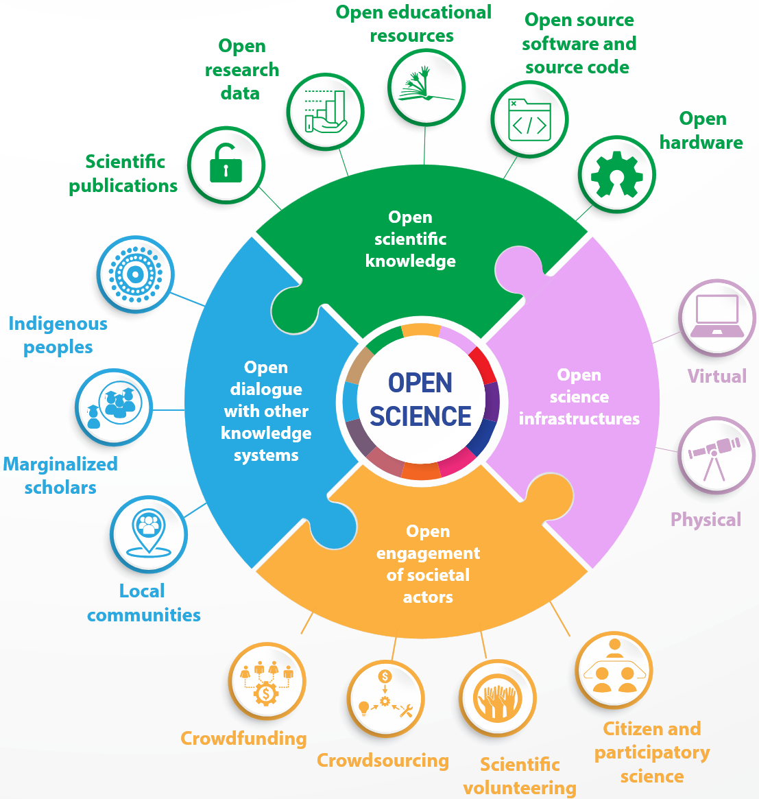{fig-align="center" width="285"}

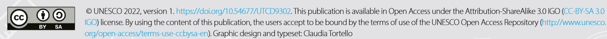{fig-align="center" width="1250"}

## Knowledge reuse

This presentation is [open-sourced](https://github.com/EricLarG4/OpenScience) and distributed under the [GPL-3.0 license](https://github.com/EricLarG4/OpenScience?tab=GPL-3.0-1-ov-file#GPL-3.0-1-ov-file).

](images/gnu.png){fig-align="center" width="500"}

You can raise [issues](https://github.com/EricLarG4/OpenScience/issues), propose [modifications of the code](https://github.com/EricLarG4/OpenScience/pulls), or fork your own copy of the presentation.

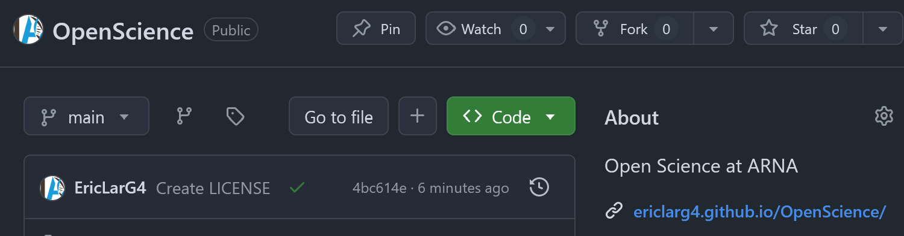{fig-align="center" width="500"}

## Data reuse

Reuse of a high-quality dataset deposited on [Zenodo] to make a much better and better controlled reference figure.[^1]

::::: columns
::: {.column width="50%"}
.](images/rama_wiki.jpg){fig-align="center" width="400"}
:::

::: {.column width="50%"}
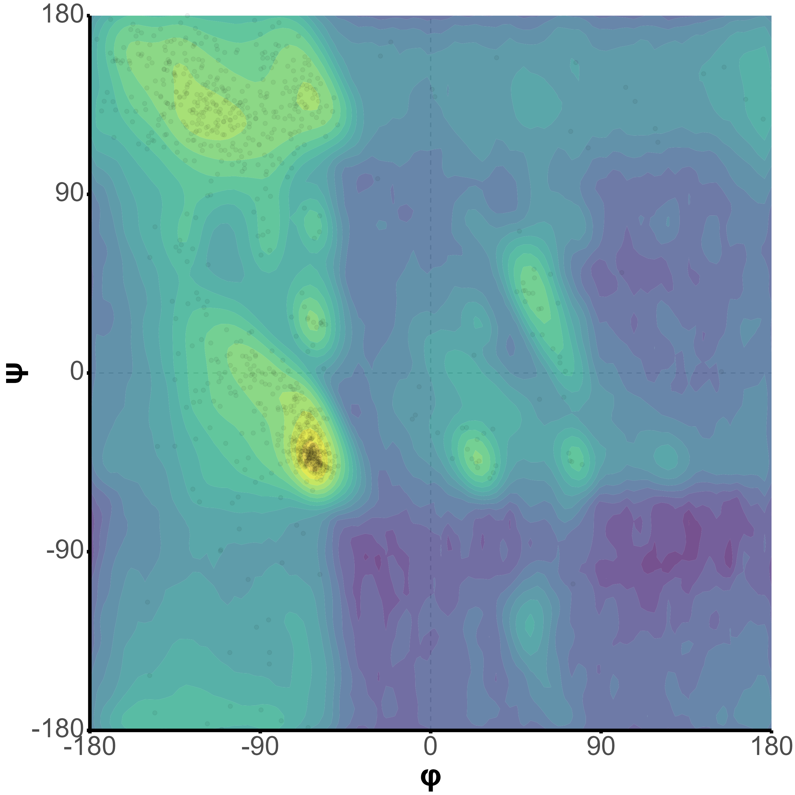{fig-align="center" width="400"}
:::
:::::
::::::

[^1]: Williams,C., Richardson,D. and Richardson,J. (2021) High quality protein residues: Top2018 mainchain-filtered residues. [10.5281/ZENODO.4626149](https://doi.org/10.5281/ZENODO.4626149)

## Why should I care?, but for pragmatists

-   Some aspects of it are made [mandatory]{.highlight} by funding agencies, trustees

    -   [Horizon Europe](https://research-and-innovation.ec.europa.eu/strategy/strategy-2020-2024/our-digital-future/open-science/open-access_en) and [ERC](https://erc.europa.eu/manage-your-project/open-science) 🇬🇧

    -   [Plan S](https://www.coalition-s.org/) 🇬🇧

    -   [Plan national pour la science ouverte](https://www.ouvrirlascience.fr/plan-national-pour-la-science-ouverte/) 🇫🇷

    -   [Charte de l’Inserm pour la science ouverte](https://pro.inserm.fr/rubriques/en-labo/science-ouverte/la-science-ouverte-a-linserm#charte-science-ouverte) 🇫🇷

        -   See the recommendation for immediate and systematic archiving: [Charte INSERM]

-   Open archive repositories may serve [individual and team evaluation]{.highlight}

-   [Open Science practices are evaluated]{.highlight} in funding/fellowship proposals

    -   E.g. Criterion 1.2 of Criterion 1 (Excellence) of MSCA fellowship: Soundness of the proposed methodology (including \[...\] the quality of open science practices)

## But people will steal my stuff!

“As open as possible, as closed as necessary”: Results and data may be kept closed if making them public in open access is against the researcher’s legitimate interests, e.g.

-   commercially exploitation of research results

-   if it is against any obligations mentioned in the Grant Agreement (e.g. personal data protection)

For instance, you can archive data on Zenodo and [only share it with specific users](https://help.zenodo.org/docs/share/user-sharing/).

## Practically, what can I do?

-   Publish in Open Access journals

    -   or make your preprint and/or accepter manuscript available

-   Share your data in open repositories

-   Use open-source tools and software

    -   And make yours open

-   Advocate for Open Science policies in your institution

    -   Please ARNA, pay for my APCs 🤑

-   Educate others about the importance and benefits of Open Science

# Section 2: How to publish Open papers without having to sell a kidney {background-color="#43418a"}

## Archiving on a pre-print repository

::: panel-tabset
## Repositories

-   Free and with good visibility for well-known repositories ([BioRχiv](https://www.biorxiv.org/){.uri}, [ChemRxiv](https://chemrxiv.org/engage/chemrxiv/public-dashboard))

    -   Indexed in e.g. Google Scholar, [Europe PMC](https://europepmc.org/)
    -   Has a DOI, citable

-   Supported by many publishers

-   Possible to revise the manuscript and thus to upload accepted manuscript

    -   See [Google Scholar]

-   Possible to link final paper to preprint

-   Authors retain copyright

-   Authors establish precedence

## Example

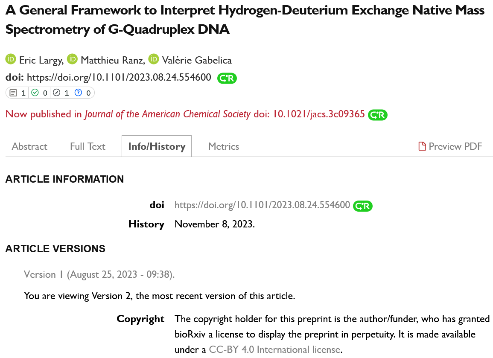{width="65%"}
:::

## Choose an open access modality

:::: panel-tabset
## 🟩 **Green OA**

-   Self-archiving on repositories or personal sites

-   Uses pre-prints or post-prints (not final publisher version)

-   May have embargo periods

-   Free access; no APCs

## 💛 **Gold OA**

-   Published in fully OA journals

-   Immediate access to final published version

-   APCs usually required

-   High visibility and wide dissemination

## 💠 **Diamond OA**

-   No APCs for authors or readers

-   Often funded by institutions, societies, governments

-   Focuses on providing free access to both readers and authors

-   Free and equitable access for all

## 🙅 **Hybrid**

-   Subscription journals with optional OA per article

-   Authors pay APCs for OA

-   Meets OA mandates

-   "Double-dipping": [subscriptions **and** APCs]{.rn rn-type="crossed-off" rn-strokeWidth="3" rn-color="tomato"}

::: {.callout-caution collapse="true"}
## INSERM's opinion [\[source\]](https://www.inserm.fr/nos-recherches/science-ouverte/#gare-au-modele-hybride)

Certaines revues fonctionnent selon un modèle hybride : les articles y sont a priori publiés selon le modèle classique (payant pour le lecteur), mais la revue donne le choix aux auteurs de payer pour que leur travail soit publié en libre accès (payant pour l’auteur). Publier en *Open Access* dans ce type de revue est dès lors fortement déconseillé car cela entraîne un double paiement : celui de l’abonnement pour consulter l’ensemble de la revue et celui des frais de publication en *Open Access*
:::
::::

## Choosing a license

::: panel-tabset
## Impact on use

The license impacts what people can do with your work, e.g.

-   CC BY: Reusers can distribute

    -   if attribution given

    -   [remixed, adapted, built upon]{.highlight}

    -   including for [commercial]{.highlight} use

-   CC BY-NC-ND: Reusers can copy and distribute the work

    -   if attribution given

    -   in [unadapted form only]{.highlight}

    -   for [non-commercial]{.highlight} use only

## Impact on cost

The license impacts the article processing charges (APCs)

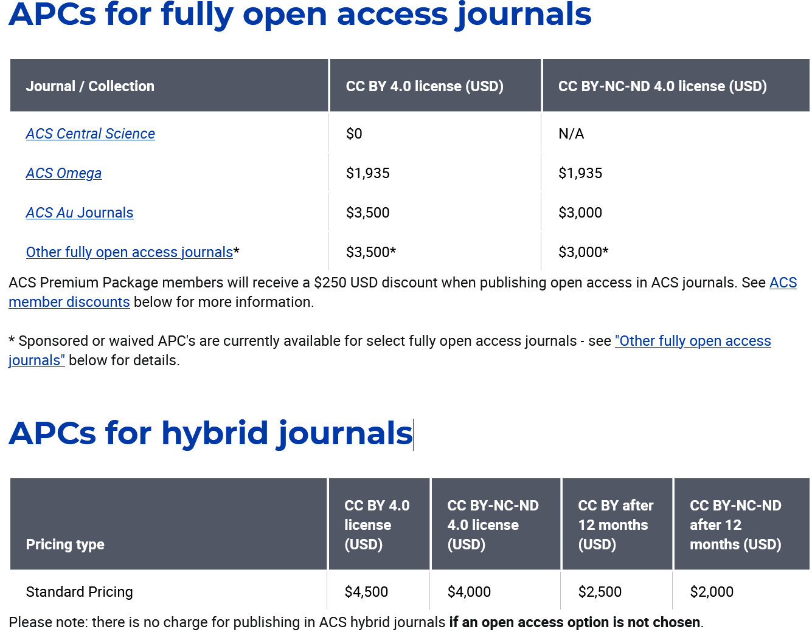{fig-align="center" width="60%"}
:::

## Couperin

:::: panel-tabset
## Choosing a journal

Journals may be selected based on many criteria

-   Reputation, impact

-   Relevance to the work

    -   [JANE: Journal/Author Name Estimator](https://jane.biosemantics.org/) 🇬🇧

[OA options (and their costs) should be considered!]{.highlight}

## Coupering.org

The Couperin consortium negotiates decreased (or no) APCs on behalf of our trustees.

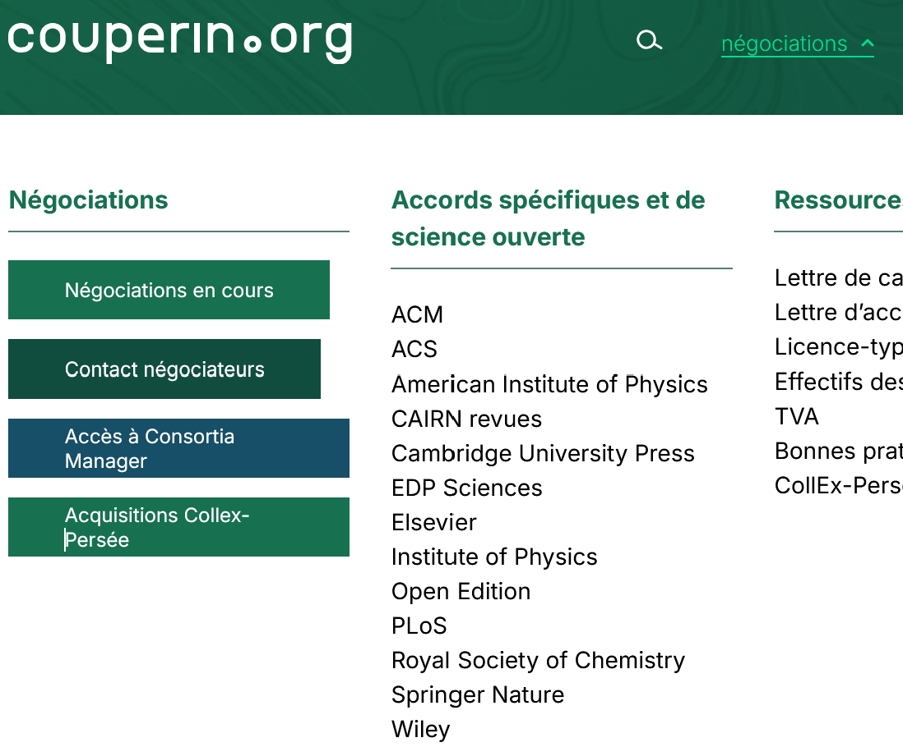{width="600"}

## Publications rights

Depending on the publisher, there might be several options and forms of financial advantages:

-   Decreased or no fees
-   Prepaid APCs

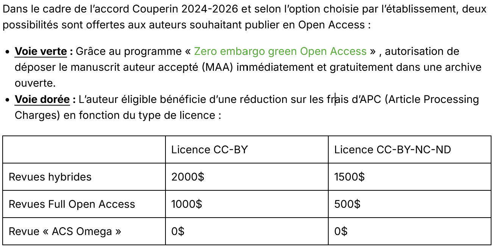{width="600"}

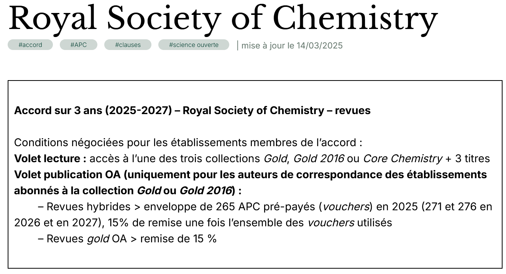{width="600"}

## Workflow

1.  Pick a publisher on Couperin.org
2.  Consult the publication rights
    1.  Check the OA and negotiation modalities
    2.  When several options are available, choose the one that fits your needs:
        1.  OA modality (green/gold/hybrid)
        2.  License type
        3.  Cost
        4.  Consider institutional/funding requirements
    3.  Check institution eligibility
3.  Consult the publisher's dedicated page for practical use (example for the [ACS](https://acsopenscience.org/customers/couperin/#publish))
4.  During submission, select the option you chose at step 2. It may be automatic (based on your institutional email/declared affiliation)
5.  Profit

::: callout-tip
## Publish at the start of the year!

For publishers where APCs are pre-paid, those might run out!

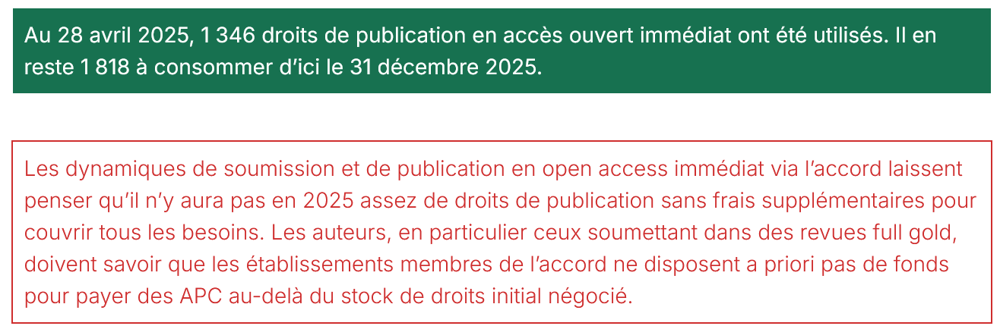{width="400"}
:::
::::

## Archiving after publication

:::::: panel-tabset
## Repositories

-   The go-to repository in France is [HAL](https://hal.science/)

    -   Possibility to link Orcid, Google Scholar, etc.

    -   Somewhat redundant local initiative @UBx: [OSKAR](https://oskar-bordeaux.fr/)

-   For PhD thesis: [theses.fr](https://theses.fr/?domaine=theses)

::: callout-warning
## Disclaimer

Publishers may require the addition of disclaimers on top of accepted/published manuscript depositions e.g. [ACS](https://pubs.acs.org/page/copyright/journals/posting_policies.html):
:::

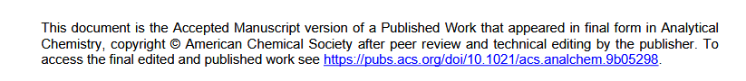

## HAL x Orcid

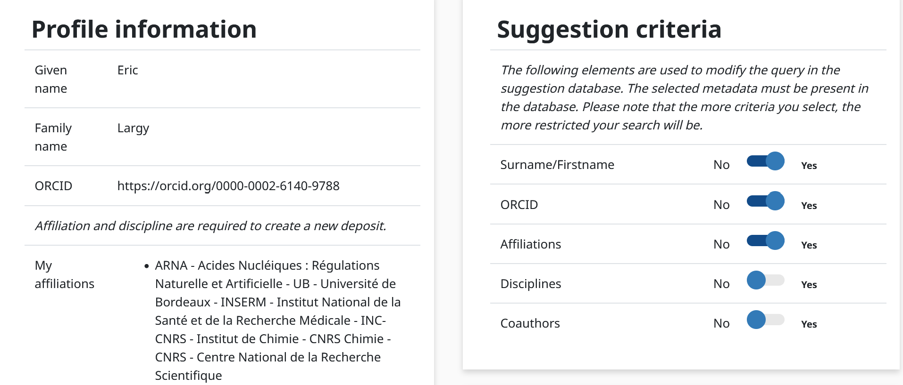

## Can I, and when?

You should:

-   [Refer to your funding mandate]{.highlight}: it may have specific requirements regarding archiving

-   [Consider the publisher's policy]{.highlight}: permissions can vary

-   Determine whether you can use the [publisher’s or the author accepted version]{.highlight} (AAM)

::: callout-tip
## I publish, what are my rights? 🇫🇷

Consult the guide from [Ouvrir la Science !](https://www.ouvrirlascience.fr/je-publie-quels-sont-mes-droits/)
:::

::: callout-note
## The opinion of [Lund's University Faculty of Law](https://www.law.lu.se/library/write-and-publish/open-access/parallell-publishing-and-copyright)

When it comes to parallel publishing/self-archiving, it is difficult to make a general statement about what is permitted or not as it varies from one publisher to another and between different types of publications, and policies are frequently updated. Even if you retain the copyright to your text, you do not automatically have the copyright to the publisher’s PDF version. Publishing houses have different policies on this, more or less official.

An important question to consider is whether you want to use the publisher’s PDF version or a so-called author’s version, the last approved and corrected manuscript version before the publisher adds their journal layout. Many publishers allow the author’s version to be used without special permission and some allow the PDF version to be used if permission is requested, even though possible contracts or official policies may state otherwise.
:::

## Google Scholar

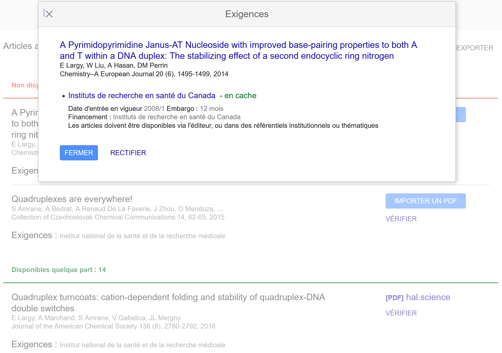{width="600"}

## Charte INSERM

Recommendation 1: Archive in an open repository

-   The 2016 Digital Republic Act \[[Légifrance](https://www.legifrance.gouv.fr/loda/id/JORFTEXT000033202746) 🇫🇷\] grants authors the [right to deposit the AAM in an open archive]{.highlight}

-   Researchers are required to [systematically deposit]{.highlight} all new scientific publications in full text in the national open archive HAL

-   AAMs must be deposited [immediately after acceptance]{.highlight} for publication

-   The use of ORCID and idHAL identifiers is highly recommended to prevent any ambiguity in author identification and to facilitate deposits

-   Articles deposited on HAL and mentioned in researchers' files will serve as the basis for evaluating their output

-   The evaluation of research structures will be based on the same principle, with the HCERES relying on collections structured in HAL (teams, units)
::::::

# Section 3: Data, code and software {background-color="#43418a"}

## Go FAIR[^2]

[^2]: *Wilkinson, M. D. et al. The FAIR Guiding Principles for scientific data management and stewardship. Sci. Data 3:160018 doi: [10.1038/sdata.2016.18](https://doi.org/10.1038/sdata.2016.18) (2016)*

::: panel-tabset
## **Findable**

-   F1. (Meta)data are assigned a globally **unique and persistent identifier**

-   F2. Data are described with **rich metadata** (defined by R1)

-   F3. Metadata clearly and explicitly include the identifier of the data they describe

-   F4. (Meta)data are registered or indexed in a searchable resource

## **Accessible**

-   A1. (Meta)data are **retrievable by their identifier** using a standardised communications protocol

    -   A1.1 The protocol is **open, free, and universally implementable**

    -   A1.2 The protocol allows for an authentication and authorisation procedure, where necessary

-   A2. Metadata are accessible, even when the data are no longer available

## **Interoperable**

-   I1. (Meta)data use a **formal, accessible, shared, and broadly applicable language** for knowledge representation.

-   I2. (Meta)data use vocabularies that follow FAIR principles

-   I3. (Meta)data include qualified references to other (meta)data

## **Reusable**

-   R1. (Meta)data are richly described with a plurality of **accurate and relevant attributes**

    -   R1.1. (Meta)data are released with a clear and accessible data usage license

    -   R1.2. (Meta)data are associated with **detailed provenance**

    -   R1.3. (Meta)data meet domain-relevant **community standards**
:::

## DMP and training

::: panel-tabset
## OPIDoR

Important service to generate your DMP, made mandatory by many funding agencies

-   [DMP](https://dmp.opidor.fr/) OPIDoR to plan your data management

    -   [Discover DMP OPIDoR in 180 seconds](https://www.canal-u.tv/chaines/inist-cnrs/embed/152543?t=0)

-   [Cat OPIDoR](cat.opidor.fr), a wiki of services dedicated to research data

-   PID OPIDoR for DOI.

    -   Must request account creation to access [DataCite](https://doi.datacite.org/)

Learn more [here](https://opidor.fr/).

## Doranum

Training platform from Inist-CNRS and Urfirst with resources to support the scientific community in managing and sharing their data

](images/doranum_example.png){fig-align="center" width="80%"}
:::

## Sharing data and software

::::::: panel-tabset
## General

Sharing data and software on open repositories

-   Facilitates collaborations
-   Increase visibility and impact
-   Promotes data reuse and innovation
-   Supports Open Science

There are numerous repositories to choose from, from general purpose to specialized ones.

You probably know those of your community; you'll find here a few general-purpose options.

## Zenodo

-   General purpose open repository built and operated by CERN and [OpenAIRE](https://www.openaire.eu/)

-   User can deposit any research-related digital item

    -   research papers
    -   data sets
    -   research software
    -   reports

<!-- -->

-   Why use Zenodo?

    -   Safe: Storage in CERN’s Data Centre for as long as CERN exists
    -   Citeable: Every upload is assigned a DOI
    -   No waiting time: Uploads available online immediately and DOI registered within seconds
    -   Open or closed: Share e.g. anonymized clinical trial data with only medical professionals via [restricted access mode](https://help.zenodo.org/docs/share/user-sharing/)
    -   Versioning: Dataset/software can be updated. DOI for all and specific versions
    -   GitHub integration

::: callout-note
Zenodo is derived from Zenodotus, the first librarian of the Ancient Library of Alexandria and father of the first recorded use of metadata, a landmark in library history
:::

## GitHub & co

Platforms like GitHub, GitLab offer numerous benefits not only to developers but also to researchers:

-   Version Control: Track changes and manage branches effectively
-   Collaboration: Enable multiple contributors to work simultaneously
-   Accessibility: Increase visibility and attract global contributors
-   Documentation: Provide comprehensive documentation and transparency
-   Integration: Automate workflows and integrates with other platforms (Zenodo, HAL)
-   Community: Network with peers and engage in open-source projects
-   Backup: Ensure reliable preservation and retrieval of code
-   Open Science: Support reproducibility and validation of research
-   Licensing: Apply open-source licenses easily for legal compliance
-   Learning: Explore projects and improve coding and collaboration skills

::::: columns
::: {.column width="50%"}
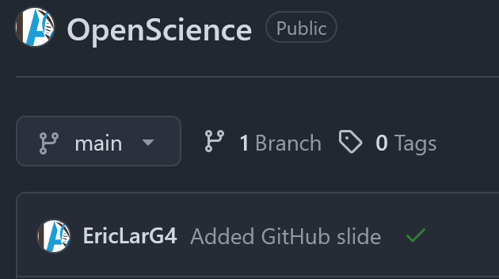{width="300"}
:::

::: {.column width="50%"}
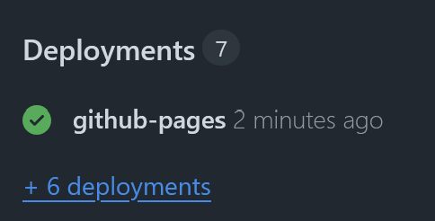{width="300"}
:::
:::::

## Zenodo x GitHub

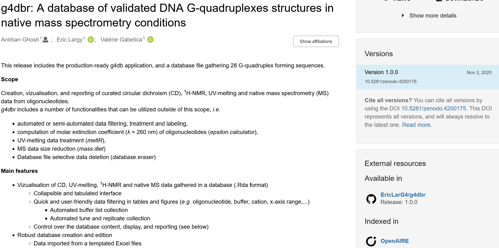{width="90%"}

## Recherche.data.gouv

[https://entrepot.recherche.data.gouv.fr/](entrepot.recherche.data.gouv.fr) is a national repository with a [generic space](https://entrepot.recherche.data.gouv.fr/dataverse/espacegenerique), and institutional spaces:

-   [INSERM](https://entrepot.recherche.data.gouv.fr/dataverse/inserm)
-   [CNRS](https://entrepot.recherche.data.gouv.fr/dataverse/cnrs)

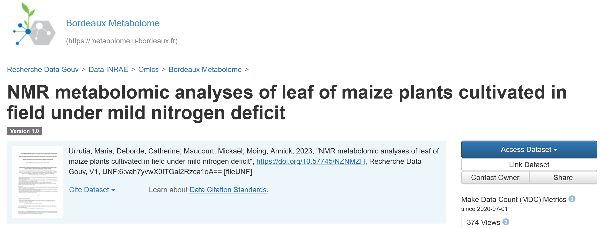{fig-align="center" width="800"}

Login with institutional email/orcid

## 
:::::::

# Section 4: Resources {background-color="#43418a"}

## General resources

-   [Research Ministry](https://www.enseignementsup-recherche.gouv.fr/fr/science-ouverte-50360) 🇫🇷
-   [Ouvrir la science!](https://www.ouvrirlascience.fr/home/) 🇬🇧🇫🇷
    -   French Committee for Open Science
    -   Ensures the implementation of the National Open Science Policy
    -   Publishes guides, workshop reports
    -   Publishes a small (and pretty) Encyclopedia of Open Science: https://encyclo.ouvrirlascience.fr/

## Funding agencies and trustees

-   [CNRS](https://www.science-ouverte.cnrs.fr/en/) 🇬🇧🇫🇷

    -   [Resources to publish in Open Access](https://www.science-ouverte.cnrs.fr/service/publier-en-acces-ouvert/)

    -   [Resources to manage and share data](https://www.science-ouverte.cnrs.fr/service/partager-et-gerer-mes-donnees/)

    -   [Resources to access papers](https://www.science-ouverte.cnrs.fr/service/acceder-a-la-documentation/): Highly recommended: the [Click & Read](https://clickandread.inist.fr/) extension ❤️

-   [INSERM](https://www.inserm.fr/nos-recherches/science-ouverte/) 🇫🇷

-   [UBx](https://www.u-bordeaux.fr/en/research/scientific-vision/open-science) 🇬🇧🇫🇷

    -   [open.u-bordeaux.fr](https://open.u-bordeaux.fr/): Open access journals from UBx

    -   [OSKAR repository](https://www.u-bordeaux.fr/en/research/scientific-vision/open-science/oskar)

-   [European Commission](https://rea.ec.europa.eu/open-science_en) 🇬🇧: Q&A on what you should comply with (for funding)

-   [Plan S](https://www.coalition-s.org/) 🇬🇧: Initiative for Open Access publishing, built by a group of national research funding organisations, with the support of the ERC

    -   [Plan S 10 principles](https://www.coalition-s.org/addendum-to-the-coalition-s-guidance-on-the-implementation-of-plan-s/principles-and-implementation/) 🇬🇧

## Specific resources: Publishing

::: panel-tabset
## APCs and licensing

-   [Couperin consortium](https://www.couperin.org/) 🇫🇷: Negociates on behalf of public entities for publication access/publishing costs (among other things)

    -   [List of publishers](https://www.couperin.org/category/negociations/accords-specifiques-so/)

-   Publication licensing

    -   [Creative Commons](https://creativecommons.org/share-your-work/cclicenses/) 🇬🇧🇫🇷: Choose what people can do with your work

        -   [Chooser](https://creativecommons.org/chooser/): Select the license that fits your need

-   Software/repository licensing

    -   [Licensing assistant from the EU Commission](https://interoperable-europe.ec.europa.eu/collection/eupl/solution/licensing-assistant/find-and-compare-software-licenses) 🇬🇧

    -   [GitHub repository licensing](https://docs.github.com/en/repositories/managing-your-repositorys-settings-and-features/customizing-your-repository/licensing-a-repository) 🇬🇧

## Preprints

-   [BioRχiv](https://www.biorxiv.org/){.uri} 🇬🇧: Bio\[insert your specialty\]

-   [ChemRxiv](https://chemrxiv.org/engage/chemrxiv/public-dashboard) 🇬🇧: Chemistry

    ::: callout-tip
    ## Europe PMC

    If a preprint has been published in a journal indexed in Europe PMC, the preprint and published article are linked. Preprints are linked to [data behind the paper](https://europepmc.org/article/PPR/PPR158775#data), can be claimed to an [ORCID](https://europepmc.org/article/PPR/PPR161858), included in [citation networks](https://europepmc.org/article/PPR/PPR30268#impact), and linked to [platforms that comment on or peer review preprints](https://europepmc.org/article/PPR/PPR701206#reviews)
    :::

## Postprints

-   [HAL](https://hal.science/) 🇬🇧🇫🇷: National repository

-   [OSKAR](https://oskar-bordeaux.fr/) 🇬🇧🇫🇷: UBx repository
:::

## Specific resources: Data, code and software

-   Guides from Ouvrir la Science!
    -   [Research data guide](https://www.ouvrirlascience.fr/wp-content/uploads/2024/03/24-02-28-Donnees-EN-WEB.pdf) 🇬🇧
    -   [Source code and software](https://www.ouvrirlascience.fr/wp-content/uploads/2023/10/23-09-23-soft_EN-web-1.pdf) 🇬🇧
    -   Also available in 🇫🇷
-   [FAIR](https://www.gofair.foundation/) data 🇬🇧
    -   [Principles](https://www.gofair.foundation/interpretation)
-   DORANum 🇫🇷
    -   [Déposer ses données de recherche : Pourquoi, quoi, quand et comment](https://doranum.fr/depot-entrepots/deposer-ses-donnees_10_13143_9d1h-h242/){.uri} ?
    -   [Vérifier ses données de recherche](https://doranum.fr/depot-entrepots/verifier-donnees-recherche_10_13143_5rs6-4r06/)
    -   [Quizz: Format ouvert ou fermé ?](https://doranum.fr/stockage-archivage/quiz-format-ouvert-ou-ferme_10_13143_mcwq-qs64/){.uri}
-   [recherche.data.gouv.fr](https://recherche.data.gouv.fr/en) 🇬🇧🇫🇷: National data ecosystem
    -   [Repository](https://entrepot.recherche.data.gouv.fr)